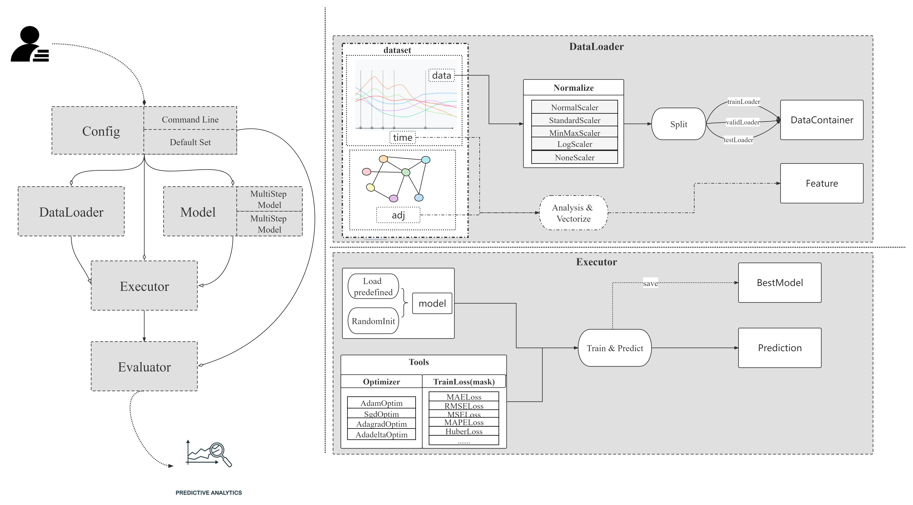

## MvTS : An Open Library For Multivariate Time Series Forecasting.

### Introduction



Modeling multivariate time series has been a subject for a long time, which attracts the attention of scholars from many fields including economics, finance, traffic, etc. As the number of models increases, it's significant to design a unified framework to implement and evaluate these models. 

`MvTS` is a systematic, comprehensive, extensible, and easy-to-use multivariate time series forecasting library. It divide the whole process into four parts: **data process, model implement, train and per-
formance evaluate,** and designs four modules: **DataLoader, Model, Executor and Evaluator**, to complete the four processes respectively, with one **Config** to complete the loading of parameters, and one **Pipeline** to pass messages between modules.

We believe `MvTS` will contribute to the research of **Multivariate Time Series** Forecasting.

### Requirements

### Usage

#### Definition

It's generally accepted that multivariate time series forecasting problems can be divided into **single-
step forecasting** and **multi-step forecasting**.

The time series with $N$ variables is denoted as $X = \{ {X}^{(1)}, {X}^{(2)},... , {X}^{(T)}\}$, where $X^{(t)}$ indicates the values of $N$ variables at time step t, with $X^{(t)} \in R^{N \times C}$. $C$ is the feature dimension of each time series. Given a long historical time series and a look-back window with the fixed-length $P$, the two problems are formalized as follows:

##### Single_Step

The goal of single-step forecasting is to obtain the future value ${X}^{(t+Q)}$ at time step $Q$ through a learned mapping function $\mathcal{F}_1$.

$$
\quad  {X}^{(t-P+1:t)} \xrightarrow{\mathcal{F}_1} {X}^{(t+Q)}
$$

##### Multi_Step

The goal of multi-step forecasting is to predict a sequence of future values ${X}^{(t+1:t+Q)}$ through a learned mapping function $\mathcal{F}_2$.

$$
{X}^{(t-P+1:t)} \xrightarrow{\mathcal{F}_2} {X}^{(t+1:t+Q)}
$$


#### Quick Start

Put the h5 File (*Described in Dataset*) into `./MTS-Library/mvts/raw_data/`, and execute following corresponding commands according to different prediction tasks.

##### Single_Step

```
cd ./MTS-Librray
Python run_model.py --task single_step --model ×××  --dataset ×××
```

##### Multi_Step

```
cd ./MTS-Library
Python run_model.py --task multi_step --model ××× --dataset ×××
```


### Datasets

`MvTS` records the **rawdata, adjacency matrix and time information** of each dataset and integrates it into the h5 file. To get the above three types of information, users can execute the following commands.

#### Load

##### RawData

```Python
file = "./raw_data/" + filename
f = h5py.File(file, "r")
RawData = np.array(f["raw_data"])
```

##### Adjacency Matrix

```python
file = "./raw_data/" + filename
f = h5py.File(file, "r")
adj = np.array(f["adjacency_matrix"]) ## For datasets whose adjacency matrix is not available, MvTS will set it zero-matrix, meaning that this matrix is meaningless.
```

##### Time

```python
file = "./raw_data/" + filename
f = h5py.File(file, "r")
time = np.array(f["time"])
t = []
for i in range(time.shape[0]):
	t.append(time[i].decode()) # It was handled by str.encode() before integrated in the h5 file.
time = np.stack(t, axis=0)
time = pd.to_datetime(time)
```

#### Access

The following are the information of datasets supported by `MvTS`. Users can download the datasets from [Google Drive](https://drive.google.com/drive/folders/1FjazvrQbesEMGdPIUmTDNrCrWDkhKlf6?usp=sharing) or [Baidu Yun](https://pan.baidu.com/s/1gArw_hGmoDldtaO9X0itKw?pwd=ifuv).

Click [here](https://drive.google.com/drive/folders/1YatrRANAQrHhRYeEd0UhMMiYrAoJlbWE?usp=sharing) to get the original data which is unprocessed.

|   Datasets    | Nodes | TimeSteps | Granularity |  StartTime  |
| :-----------: | :---: | :-------: | :---------: | :---------: |
| AirAualityUCI |  12   |   9357    |    1hour    | x03/10/3004 |
|   covid-19    |  284  |    816    |    1day     | 01/22/2020  |
|      ECG      |  140  |   5000    |      -      |      -      |
|  electricity  |  321  |   26304   |    1hour    | 07/01/2016  |
|     ETTh1     |   7   |   17420   |    1hour    | 07/01/2016  |
|     ETTh2     |   7   |   17420   |    1hour    | 07/01/2016  |
|     ETTm1     |   7   |   69680   |    15min    | 07/01/2016  |
|     ETTm2     |   7   |   69680   |    15min    | 07/01/2016  |
| exchange-rate |   8   |   7588    |    1day     | 01/01/1990  |
|    illness    |   7   |    966    |    7day     | 01/01/2002  |
|    metr-la    |  207  |   34272   |    5min     | 03/01/2012  |
|   nyc-bike    |  250  |   4368    |    30min    | 04/01/2016  |
|   nyc-taxi    |  266  |   4368    |    30min    | 04/01/2016  |
|   pems-bay    |  325  |   52116   |    5min     | 01/01/2017  |
|    PEMS03     |  358  |   26208   |    5min     | 05/01/2012  |
|    PEMS04     |  307  |   16992   |    5min     | 07/01/2017  |
|    PEMS07     |  883  |   28224   |    5min     | 05/01/2017  |
|    PEMS08     |  170  |   17856   |    5min     | 07/01/2016  |
|     solar     |  137  |   52560   |    10min    | 01/01/2006  |
|    traffic    |  862  |   17544   |    1hour    | 07/01/2016  |
|    weather    |  21   |   52696   |    10min    | 01/01/2020  |
|      WTH      |  12   |   35064   |    1hour    | 01/01/2010  |
|     wind      |  28   |   10957   |    1day     | 01/01/1986  |

If you want to develop new dataset into `MvTS`,  you need to organize the new dataset in the same format and store it in h5 file.  Among them, the processing of **time** information can refer to the following method. (To be convenient, we use the common used *csv* file for an example.)

```Python
def handle_csv(filename, outname):
    df = pd.read_csv(filename)
    columns = df.columns
    # data = df[columns[1:]]
    # data = np.array(data)
    time = df[columns[0]]
    time = pd.to_datetime(time)
    mid = np.array(time.values)
    res = []
    for i in range(mid.shape[0]):
        res.append(str(mid[i]).encode())
    time = np.stack(res, axis=0)  ### result
    # print(time.shape)
    # print(time)
```

If the **time** information is not available directly for some reason. Then users can  generate one as the following way.

```python
#parameters
    "timeList_gene": {
      "unit": "m",
      "origin": "2018-01-01",
      "time_step": 15
    },
    "//this is notes for timeList gene" : {
      "unit": "the time unit. d: daily; h: hour; m: minute; s:second; ms,us, ns...",
      "origin": "the base-time for gene",
      "time_step": "the Length of each time hop"
    }
        
def geneTimeList(self):
    time = []
    for i in range(self.seq_len): #序列长度
        time.append(i * self.timeList_gene["time_step"]) #parameters

        res = pd.to_datetime(
            time,
            unit=self.timeList_gene["unit"],
            origin=self.timeList_gene["origin"]
        )
	
    return res 
	##time
```


### Models

Currently, the models supported by `MvTS` are as follows, and we'll continuously develop new models into it.

#### Single_Step Models

- LSTNET (Lai, Guokun, 2017) ([paper](https://doi.org/10.48550/arxiv.1703.07015))
- TPA-LSTM (Shih, Shun-Yao, 2018) ([paper](https://doi.org/10.48550/arxiv.1809.04206))
- StemGNN (Cao, Defu, 2021) ([paper](https://doi.org/10.48550/arxiv.2103.07719))
- MTGNN (Wu, Zonghan, 2020) ([paper](https://doi.org/10.48550/arxiv.2005.11650))
- ESG (Ye, Junchen, 2022) ([paper](https://doi.org/10.48550/arxiv.2206.13816))
- DARNN (Qin, Yao, 2017) ([paper](https://doi.org/10.48550/arxiv.1704.02971))
- AutoFormer (Wu, Haixu, 2021) ([paper](https://doi.org/10.48550/arxiv.2106.13008))
- BHTARIMA (Shi, Qiquan, 2020) ([paper](https://doi.org/10.48550/arxiv.2002.12135))
- AdaRNN (Du, Yuntao, 2021) ([paper](https://doi.org/10.48550/arxiv.2108.04443))

#### Multi_Step Models

- DCRNN (Li, Yaguang, 2017) ([paper](https://doi.org/10.48550/arxiv.1707.01926))
- STGCN (Bing Yu, 2017) ([paper](https://doi.org/10.24963%2Fijcai.2018%2F505))
- GWNET (Zonghan Wu, 2019) ([paper](https://arxiv.org/abs/1906.00121))
- STSGCN (Chao Song, 2020) ([paper](https://doi.org/10.1609/aaai.v34i01.5438))
- STFGNN (Li, Mengzhang, 2020) ([paper](https://doi.org/10.48550/arxiv.2012.09641))
- DGCRN (Li, Fuxian, 2021) ([paper](https://doi.org/10.48550/arxiv.2104.14917))
- StemGNN (Cao, Defu, 2021) ([paper](https://doi.org/10.48550/arxiv.2103.07719))
- GTS (Shang, Chao, 2021) ([paper](https://doi.org/10.48550/arxiv.2101.06861))
- CCRNN (Ye, Junchen, 2020) ([paper](https://doi.org/10.48550/arxiv.2012.08080))
- MTGNN (Wu, Zonghan, 2020) ([paper](https://doi.org/10.48550/arxiv.2005.11650))
- AGCRN (Bai, Lei, 2020) ([paper](https://doi.org/10.48550/arxiv.2007.02842))
- ESG (Ye, Junchen, 2022) ([paper](https://doi.org/10.48550/arxiv.2206.13816))
- STGNN (Wang, Xiaoyang, 2020) ([paper](https://doi.org/10.1145/3366423.3380186))
- STODE (Zheng Fang, 2021) ([paper](https://doi.org/10.1145%2F3447548.3467430))
- ASTGCN (Shengnan Guo, 2019) ([paper](https://doi.org/10.1609/aaai.v33i01.3301922))
- GMAN (Zheng, Chunpan, 2019) ([paper](https://doi.org/10.48550/arxiv.1911.08415))
- Informer (Zhou, Haoyi, 2020) ([paper](https://arxiv.org/abs/2012.07436))
- AutoFormer (Wu, Haixu, 2021) ([paper](https://doi.org/10.48550/arxiv.2106.13008))
- SAAM (Moreno-Pino, 2021) ([paper](https://arxiv.org/abs/2107.05984))
- SCINET (Liu, Minhao, 2021) ([paper](https://arxiv.org/abs/2106.09305))
- NBeats (Oreshkin, Boris N. , 2019) ([paper](https://arxiv.org/abs/1905.10437))
- FC-GAGA (Oreshikin Boris N., 2020) ([paper](https://arxiv.org/abs/2007.15531))
- ST-Norm (Jinliang Deng, 2021) ([paper](https://doi.org/10.1145/3447548.3467330))
- DeepAR (Salinas, 2017) ([paper](https://arxiv.org/abs/1704.04110))


### Extensibility

It's our great honor if you are interest in `MvTS`, and any modification are welcome to contribute to the development of `MvTS`, for example, new datasets, new models and bugs, etc.... 

We have created a guide to help you understand the workflow of `MvTS` and develop the library. You can read it [here](Extensibility.md).


### Citation


